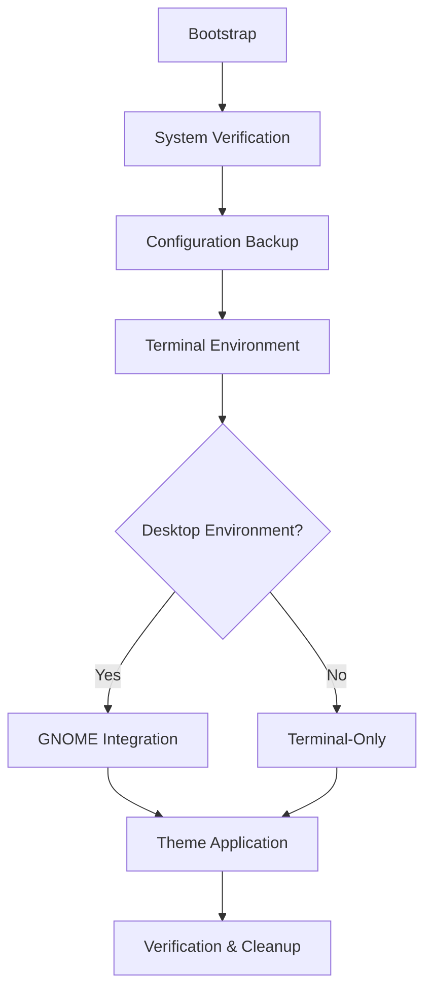

# Title

<!-- SPDX-FileCopyrightText: 2025 The Karei Authors -->
<!-- SPDX-License-Identifier: CC0-1.0 -->

## Karei

**Linux development environment automation**

> ⚠️ **Work in Progress**: This project is under active development. Many features are incomplete or broken. Please wait for a proper release before using in any real environment. Not accepting PRs or looking for contributors at this time.

Karei automates the setup of Linux development environments using a hexagonal architecture pattern. It aims to provide a clean, testable way to configure development workstations with modern tools and consistent theming.

## Design Goals

- **Hexagonal Architecture**: Clean separation between domain logic and platform-specific code
- **Multi-Distribution Support**: Ubuntu now, Debian, Fedora and SUSE planned via adapters
- **Go Implementation**: Single binary, no runtime dependencies
- **Testable**: Unit and integration tests for reliability
- **Modern Tools**: Fish shell, Neovim, containerization, modern CLI replacements

## Quick Start

### Installation

```bash
# Install latest release
curl -L https://github.com/janderssonse/karei/releases/latest/download/karei -o ~/.local/bin/karei
chmod +x ~/.local/bin/karei
karei init
```

### Uninstallation

```bash
# Remove everything Karei installed
karei uninstall --all

# Or remove just the Karei binary
rm ~/.local/bin/karei
```

### Post-Installation Management

```bash
karei              # Launch interactive management interface
karei theme apply --name tokyo-night  # Configure system-wide themes
karei font install --name JetBrainsMono  # Manage terminal typography
karei update       # Update system components
```

## Architecture Overview

### System Design

Karei uses hexagonal architecture (ports and adapters) to keep the core logic separate from platform-specific details:

- **Domain Layer**: Core logic that works across all Linux distributions
- **Adapter Pattern**: Platform-specific implementations (Ubuntu/Debian, Fedora, SUSE)
- **XDG Compliance**: Follows standard Linux file organization conventions
- **Atomic Operations**: Changes can be rolled back if something goes wrong
- **Security**: Input validation, minimal sudo usage, proper logging

### Installation Flow



### Component Architecture

| Layer | Purpose | Implementation |
|-------|---------|---------------|
| **Domain Layer** | Business entities and rules | Package, Theme, System models |
| **Application Layer** | Use cases and orchestration | InstallService, ThemeService |
| **Adapter Layer** | Platform-specific implementations | Ubuntu, Fedora, Arch adapters |
| **Infrastructure** | External integrations | APT, DNF, Pacman, Flatpak, Snap |
| **TUI Interface** | Interactive management | Bubble Tea framework with viewport scrolling |
| **CLI Interface** | Command-line operations | Urfave/cli with structured output |

## Features and Capabilities

### Development Environment

- **Modern Shell**: Fish shell with intelligent autosuggestions and syntax highlighting
- **Contemporary Tools**: Replaces traditional Unix tools with modern alternatives (eza, bat, zoxide)
- **Version Management**: mise with enhanced security (asdf backend disabled, checksum verification enabled)
- **Container Platform**: Podman as Docker-compatible container runtime
- **Text Editing**: Neovim with professional configuration

### Desktop Integration

- **GNOME Customization**: Comprehensive theming and extension management
- **Application Suite**: Curated selection of development and productivity applications
- **Terminal Emulator**: Ghostty for high-performance terminal experience
- **Font Management**: Professional programming fonts with dynamic switching

### Security and Compliance

- **SSH Configuration**: Automated key generation and secure defaults
- **Git Security**: Commit signing with SSH keys
- **Proxy Support**: Enterprise proxy configuration management
- **System Hardening**: Optional security tool integration (Lynis, unattended-upgrades)

### Theme System

Coordinated theming across multiple applications:

| Theme | Description | Applications Covered |
|-------|-------------|---------------------|
| **tokyo-night** | Dark theme with subtle blue accents | GNOME, Ghostty, Neovim, VSCode, btop |
| **catppuccin** | Pastel color palette with high contrast | Full application suite |
| **nord** | Arctic-inspired minimal palette | Complete desktop integration |
| **everforest** | Comfortable green-based color scheme | All supported applications |
| **gruvbox** | Retro groove color scheme (dark/light) | Comprehensive theme coverage |
| **kanagawa** | Japanese-inspired color palette | Full theme integration |
| **rose-pine** | Warm, muted color scheme | Complete application theming |

## Installation Components

### Terminal Environment (Always Installed)

**Core Components**:
- Fish shell with vendor directory support
- Starship prompt with git integration
- Modern CLI tool replacements
- Git with secure configuration
- Neovim with LSP support

**Optional Development Tools**:
- Language-specific runtimes (Python, Node.js, Ruby, Rust, Go)
- Container orchestration (K3s, K9s)
- Database clients and tools
- Security scanning utilities
- Development productivity tools

### Desktop Environment (GNOME Systems)

**Core Applications**:
- Ghostty terminal emulator
- Visual Studio Code
- System utilities and media tools

**Optional Applications**:
- Password managers (1Password)
- Communication tools (Signal)
- Development IDEs (specific language support)
- Entertainment applications (Spotify, Steam)
- Professional tools (OBS Studio, GIMP)

## Technical Requirements

### System Prerequisites

- **Operating System**: Ubuntu 24.04 LTS or later (additional Linux distributions planned)
- **Architecture**: x86_64 (AMD64)
- **Memory**: Minimum 4GB RAM (8GB recommended for full installation)
- **Storage**: 10GB available space (20GB recommended)
- **Network**: Reliable internet connection for package downloads

### Supported Environments

- **Physical Installations**: Native Linux desktop systems
- **Virtual Machines**: VirtualBox, VMware, QEMU/KVM
- **Cloud Instances**: AWS EC2, GCP Compute Engine, Azure VMs
- **Development Containers**: Docker/Podman with GUI forwarding

## Management Interface

### Interactive Menu System

The `karei` command provides a comprehensive management interface:

```bash
# System management
karei menu         # Full interactive menu
karei update       # Update Karei and components
karei install --packages vim,git  # Install additional applications
karei uninstall    # Remove applications safely

# Appearance customization
karei theme list   # System-wide theme management
karei font list    # Terminal font configuration

# System utilities
karei logs         # View installation logs
karei verify       # Verify system integrity
karei migrate      # Run system migrations
```

### Command-Line Operations

All operations support both interactive and scriptable modes:

```bash
# Scriptable theme application
karei theme apply --name tokyo-night

# Automated font configuration
karei font install --name CaskaydiaMono

# Silent application installation
karei install --packages docker
```

## Configuration Management

### XDG Compliance

Karei follows the XDG Base Directory Specification:

```bash
$XDG_CONFIG_HOME     # Application configurations
$XDG_DATA_HOME       # Application data
$XDG_CACHE_HOME      # Cached data
$XDG_STATE_HOME      # Application state
$XDG_BIN_HOME        # User binaries
```

### Backup and Recovery

Automatic backup system creates timestamped snapshots:

```bash
# Backup locations
~/.local/share/karei/backups/[timestamp]/
├── manifest.json    # Backup metadata
├── configs/         # Configuration files
└── restore.sh       # Automatic restore script
```

### User Customization

Karei preserves user customizations through the include pattern:

```bash
# Git example - user configs override Karei defaults
~/.gitconfig         # User's personal Git configuration
├── [include]
└── path = ~/.config/git/config  # Karei defaults
```

## Extension Ecosystem

### Community Extensions

The Karei ecosystem supports community-developed extensions:

- **Theme Extensions**: Custom color schemes and visual modifications
- **Application Packages**: Additional software installation scripts
- **Configuration Overrides**: Alternative configurations for existing tools

### Development Guidelines

Extensions should follow established patterns:

- XDG compliance for configuration placement
- Atomic operations with rollback capability
- Comprehensive logging and error handling
- Security validation for external dependencies

## Troubleshooting and Support

### Log Analysis

```bash
# Installation logs
karei logs install

# Theme operation logs  
karei logs theme

# Application-specific logs
karei logs [application-name]
```

### Common Issues

| Issue | Diagnostic | Resolution |
|-------|------------|------------|
| **Installation Failure** | Check system requirements | Run `karei verify` |
| **Theme Not Applied** | Verify GNOME session | Restart session or run `karei theme list` |
| **Application Missing** | Check installation logs | Re-run `karei install --packages [app]` |
| **Performance Issues** | Monitor system resources | Consider minimal installation |

### Recovery Procedures

```bash
# Restore from backup
~/.local/share/karei/backups/[timestamp]/restore.sh

# Reset to defaults
karei reset

# Complete reinstallation
karei uninstall --all && bash <(curl -s https://karei.org/install)
```

## Contributing

### Development Workflow

```bash
# Clone repository
git clone https://github.com/janderssonse/karei.git
cd karei

# Development commands
just dev          # Build and verify
just test         # Run all tests
just lint         # Run linters
just build-host   # Build for current architecture

# Test coverage
go test -cover ./internal/...
```

### Guidelines

- Follow XDG Base Directory Specification
- Implement comprehensive error handling
- Include security validation for all operations
- Maintain backward compatibility
- Provide clear documentation

## Security Considerations

### Default Security Posture

- **Minimal Privilege Escalation**: sudo usage limited to essential operations
- **HTTPS-Only Downloads**: All external resources use TLS
- **Input Validation**: Comprehensive sanitization of user inputs
- **Audit Trail**: Complete logging of security-relevant operations

### Optional Security Enhancements

```bash
# Enable additional security tools
karei install --group security

# Configure automatic updates
karei install --packages unattended-upgrades

# System hardening audit
lynis audit system
```

## Project Status

⚠️ **Early Development** - Not ready for production use

**Language**: Go 1.23+  
**Architecture**: Hexagonal (Ports & Adapters)  
**Supported**: Ubuntu 24.04 (partial)  
**Planned**: Debian, Fedora, openSUSE  
**Documentation**: [Architecture](docs/HEXAGONAL_ARCHITECTURE.md) | [TUI Design](docs/tui-architecture.md)

## License

Karei is released under the [EUPL-1.2 License](LICENSE).

### Dependencies

Built with Bubble Tea (TUI framework), Lipgloss (styling), Urfave/cli (CLI parsing), and Testify (testing).

## Resources

- **Documentation**: [docs/](docs/) directory contains detailed technical documentation
- **Extensions**: [EXTENSIONS.md](EXTENSIONS.md) for community add-ons
- **Configuration Patterns**: [docs/configuration-patterns.md](docs/configuration-patterns.md)
- **Installation Structure**: [docs/installation-structure.md](docs/installation-structure.md)
